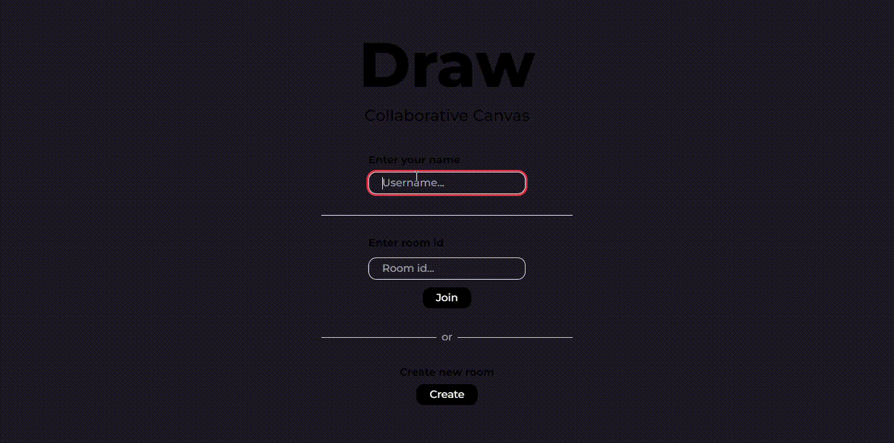

## Draw

<h3> Tech Stack Used  </h3>
<p align="left">
  <a href="https://www.typescriptlang.org/" target="_blank">
    
  </a>
  <a href="https://nextjs.org/" target="_blank">
    
  </a>
</p>

## Getting Started
```bash
npm i
npm run dev
```


### Preview


=======